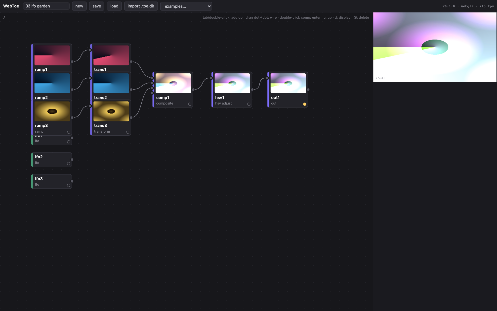
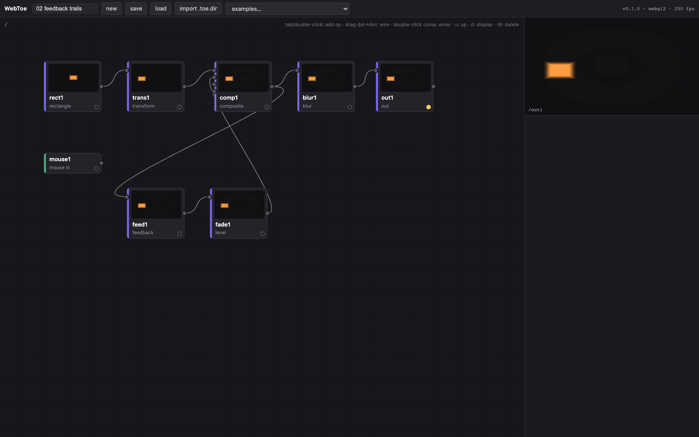
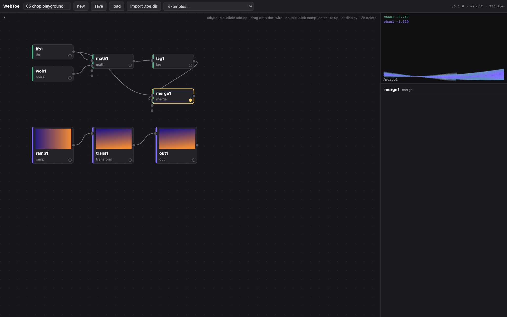
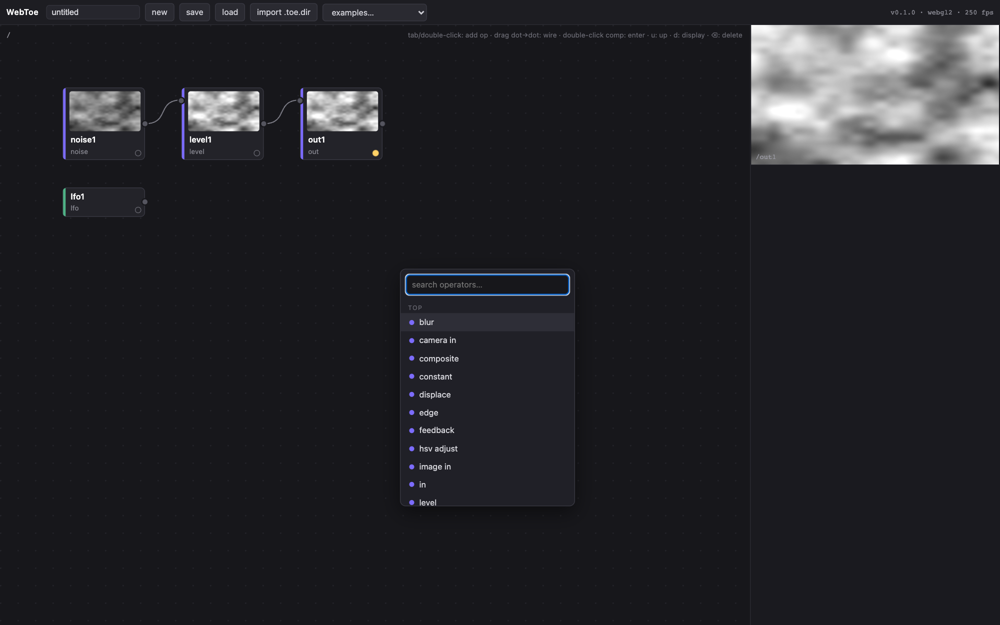
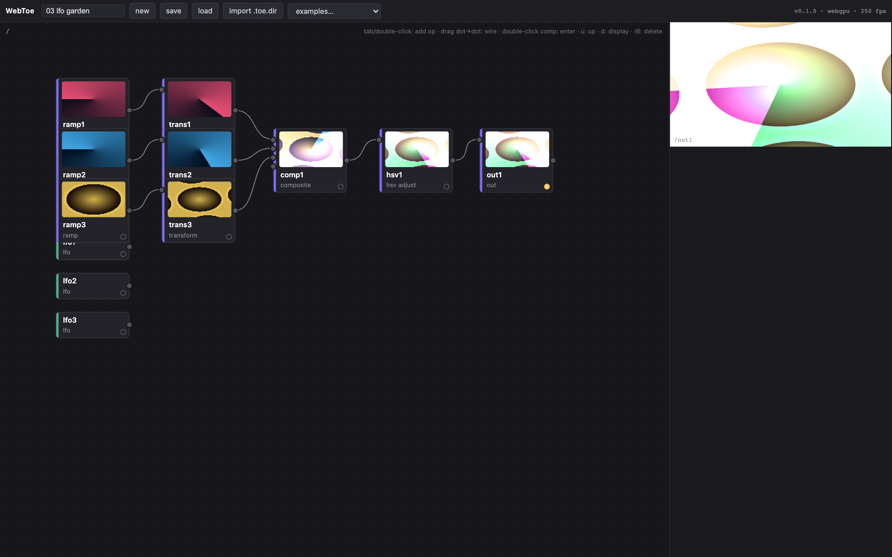
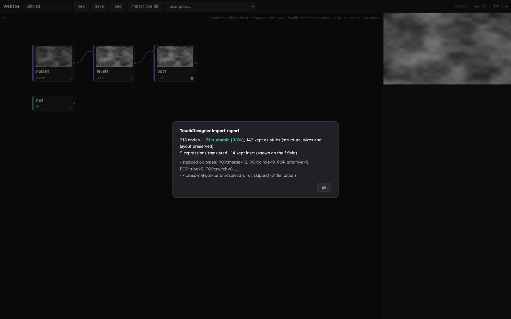

# WebToe

**A web-native, node-based dataflow engine for real-time visuals — patch operators together in the browser, TouchDesigner-style, and import your existing TouchDesigner projects.**

[](https://github.com/frank890417/WebToe/actions/workflows/ci.yml)
[](LICENSE)
[](https://frank890417.github.io/WebToe/)

**▶ Try it now: [frank890417.github.io/WebToe](https://frank890417.github.io/WebToe/)** — no install, runs entirely in your browser.



WebToe is an original engine and editor built from scratch for the web. It is not a TouchDesigner clone or port — it implements the workflow (operator families, wired networks, expression-driven parameters, a live cook loop) natively on **WebGL2 and WebGPU**, with **zero runtime dependencies** (the whole app is ~90 KB of JS), and it reads the structure of real TouchDesigner projects through the text expansion produced by your own TD installation.

## Highlights

- **Patch live in the browser** — network editor with a create-operator dialog (`Tab` / double-click: family tabs, searchable grid), wire dragging, container hierarchy with in/out tunneling, **real-time previews on every node** (one GPU compositor paints the viewer and all visible thumbnails at full frame rate — no CPU readbacks), and a parameter panel with sliders, menus, and per-parameter **expressions** (`op('lfo1')['chan1']`, `parent().par.speed`, `time.seconds * 0.2`, …).
- **Real-time GPU engine** — pull-based cook loop; TOPs run as GPU passes, CHOPs drive parameters; feedback loops, separable blur, 6-mode compositing, displacement, edge detection, webcam/video/image input.
- **Two GPU backends at parity** — WebGL2 (default, universal) and WebGPU (`?backend=webgpu`), both speaking one backend-agnostic pass contract; WebGPU's compute path is reserved for the upcoming particle family.
- **TouchDesigner import** — supported operators run live, everything else becomes a faithful stub preserving names, wires, layout, parameters, and Python code, with an honest report. Verified on real production projects.
- **Own versioned format** — lossless `.webtoe.json` save/load with migration hooks.

| Feedback trails (mouse-driven) | CHOP scope & channels |
|---|---|
|  |  |

| Operator palette | WebGPU backend |
|---|---|
|  |  |

## Importing your TouchDesigner projects



Every TouchDesigner install ships `toeexpand`, the official CLI that converts a binary `.toe` into readable text. WebToe consumes that expansion — your project files never leave your machine, and WebToe bundles nothing of Derivative's.

**Drop files anywhere on the page**: a `.webtoe.json` loads, a `.toe.dir` folder imports, and a raw `.toe` opens a guide with the exact copy-paste `toeexpand` command for your file (the binary container is proprietary, so the one-time expansion runs with your own TD install) plus a folder picker for the result.

```bash
# option A — one-step CLI (finds toeexpand in your local TD install):
node packages/cli/toe-convert.mjs myproject.toe        # → myproject.webtoe.json

# option B — expand manually, then drop the .toe.dir folder onto the page:
"/Applications/TouchDesigner.app/Contents/MacOS/toeexpand" myproject.toe
```

What the importer recovers: node types and hierarchy, wires (including wires across COMP boundaries and in/out tunnels), parameter values, **live Python expressions** (translated to WebToe expressions where faithful — `absTime.seconds*0.2` → `time.seconds*0.2` — and kept inert otherwise), DAT text and Python source, and network layout. The parameter mode field is a bitfield decoded from production files (bit 0 = expression), so flagged expression modes import too.

### Tested, automatically

`.toe` reading is covered by a two-layer automated suite built on an **original committed fixture** — a real binary `.toe` plus its canonical `toeexpand` expansion, authored for this repo and round-tripped through the official tools ([provenance](tests/fixtures/README.md)):

1. a CI-safe layer asserts the full reconstructed graph — types, COMP-boundary and tunnel wires, parameter modes, translated expressions evaluated in the engine, honest stubs, report numbers;
2. an integration layer (auto-skipped where TD isn't installed) expands the committed binary with the real `toeexpand` and runs the CLI end-to-end.

## Operator set (v1)

| Family | Operators |
|---|---|
| TOP | constant, noise, ramp, rectangle, transform, level, monochrome, hsv adjust, blur, composite, math, switch, select, reorder, flip, displace, edge, feedback, **render**, null, in, out, image in, video in, camera in |
| CHOP | constant, lfo, noise, math (full TD pipeline), lag, merge, select, switch, speed, parameter, mouse in, in, out |
| SOP | line, circle, rectangle, grid, sphere, box, tube, torus, merge, transform, noise, copy, skin, add, point, facet, switch, null, in, out |
| MAT | constant, lit (phong/pbr), line, point sprite, wireframe, switch, null |
| COMP | container, **geometry** (SOP networks, materials, SOP-point instancing), **camera** (look-at), **light**, **ambient light** |
| DAT | text, table, select, null, in, out |

Plus per-family stub operators used by the importer. Expressions ship with `time`, `me`, `op()` channel access, and a math library (`sin`, `clamp`, `fract`, `lerp`, `rand(seed)`, …).

## Examples

Ten bundled projects load from the toolbar and run out of the box. The flagship is **09 showcase** — 27 nodes exercising every family at once: a webcam layer through edge detection, a kaleidoscope COMP with in/out tunnels, a mouse-position source switch, noise displacement, hue-drifting feedback trails, and a full CHOP rig (lag, speed integrator, parameter reader, full math pipeline) driving it through eight live expressions. Newest: **10 3d lines** — the full 3D pipeline: skinned line ribbons and noise-scattered instanced spheres inside geometry COMPs, an orbiting look-at camera, lights, a render TOP, and a glow post chain. Also: five authored 2D patches — **hello noise** (expression-driven brightness), **feedback trails** (move your mouse over the viewer), **lfo garden** (additive ramp chains with hue drift), **webcam displace** (allow camera access; degrades gracefully without one), **chop playground** (select `merge1` to scope raw vs lagged channels) — and three **real 2022 TouchDesigner daily sketches imported through the `.toe` pipeline** (pseudo-voronoi, fractal feedback, and a mouse-interactive CHOP study; lightly adapted for the web, e.g. movie sources swapped for noise).

## Quick start (development)

```bash
npm install
npm run dev        # editor at http://localhost:8643/WebToe/
npm run check      # typecheck + 60-test suite
npm run build      # production build (apps/web/dist)
node tools/capture-screens.mjs   # regenerate README screenshots (needs dev server + Chrome)
```

## Architecture

npm workspaces with a strict downward dependency rule — `apps/web → editor → {ops, gpu, io} → core`, where `core` imports nothing:

| Package | Role |
|---|---|
| `@webtoe/core` | graph model, pull-based cook engine, expression system, backend-agnostic GPU pass contract, versioned serialization, public `registerOp` plugin API |
| `@webtoe/ops` | operator definitions; CHOP kernels behind a WASM-ready interface; TOP shaders authored per backend (GLSL **and** WGSL, hand-written) |
| `@webtoe/gpu` | WebGL2 backend + WebGPU backend (parity), texture pools, ping-pong feedback, async readback thumbnails |
| `@webtoe/io` | `.webtoe.json` + the `toeexpand`-output importer behind a `ProjectLoader` adapter (Derivative's announced official JSON format slots in beside it) |
| `@webtoe/editor` | embeddable, framework-free editor — `mountEditor(el, opts)` |
| `@webtoe/cli` | `toe-convert.mjs` |

Deep dives: [docs/ARCHITECTURE.md](docs/ARCHITECTURE.md) · execution contract & milestones: [PLAN.md](PLAN.md) · build log: [WORKLOG.md](WORKLOG.md) · research foundation (file-format findings, feasibility, sources): [docs/RESEARCH.md](docs/RESEARCH.md)

## Roadmap — measured against real work

To define "complete", we analyzed **60 real TouchDesigner projects (28,698 nodes, 2022–2026)** from a daily-practice generative art portfolio and crawled the **official operator inventory (~675 operators across 7 families)**. Two documents drive the evolution: **[docs/ROADMAP.md](docs/ROADMAP.md)** (phased plan with measured results — corpus coverage: 32.3% → 47.1% → **62.3%** across two measured evolution cycles, the second being the full 3D pipeline) and **[docs/TD-PARITY.md](docs/TD-PARITY.md)** (the full parity charter: per-family op tiers, portable vs web-equivalent vs native-only classification, and the engine-concept gaps — time slicing, audio, 3D, GLSL, POPs, panels — with the standing measure→pick→implement→verify loop).

## Disclaimer

WebToe is an independent open-source project, **not affiliated with or endorsed by Derivative Inc.** TouchDesigner is a trademark of Derivative Inc. WebToe contains no Derivative code, binaries, or assets; it reads the text expansion of project files that users generate locally with their own licensed TouchDesigner installation, for interoperability. All engine code, shaders, and UI design in this repository are original work.

## License

[MIT](LICENSE)
